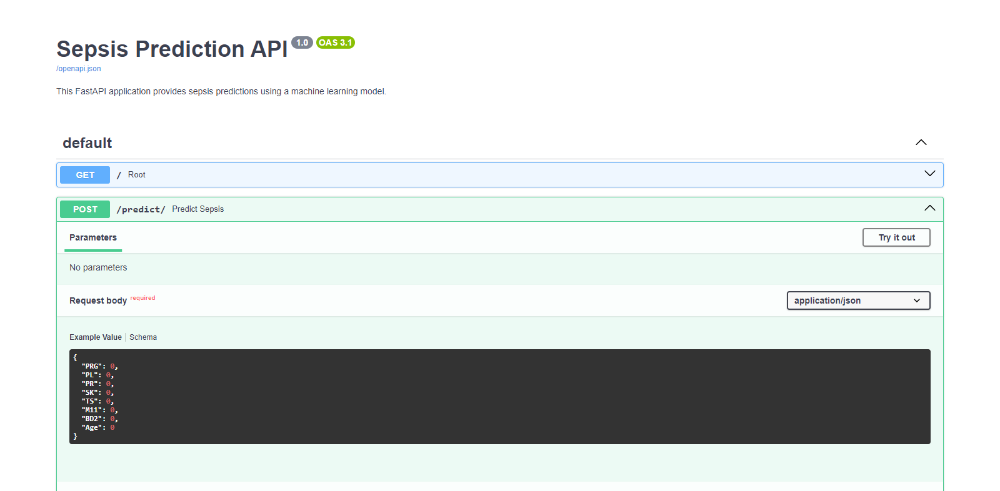
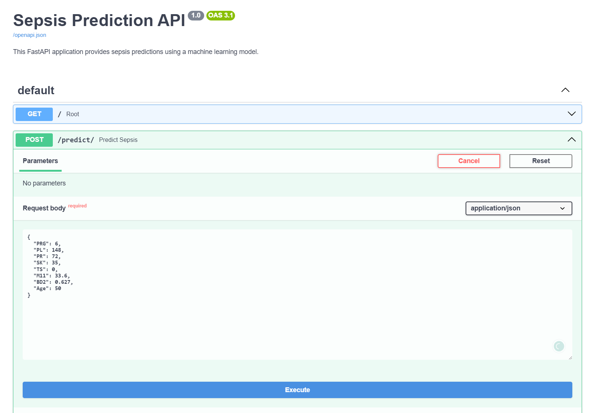
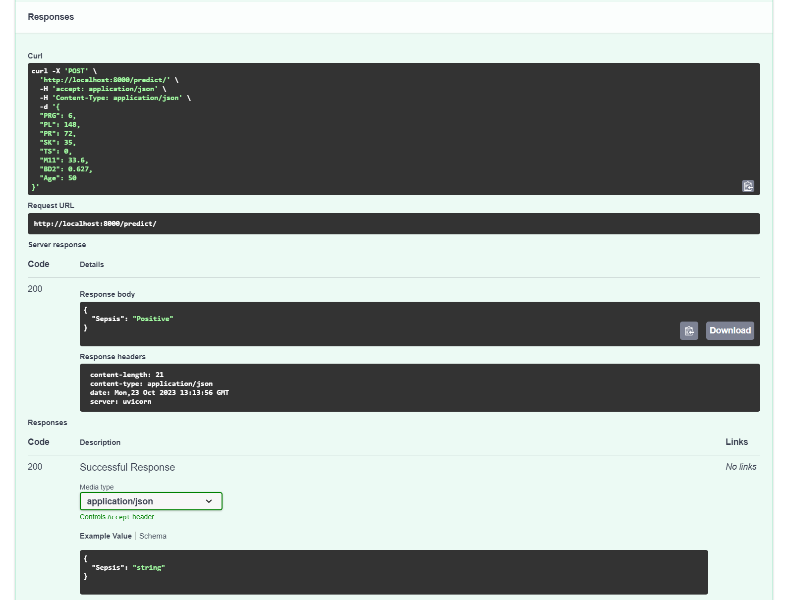
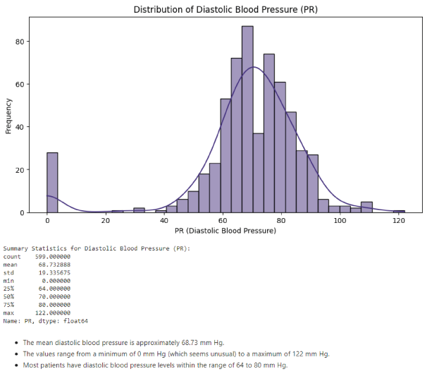
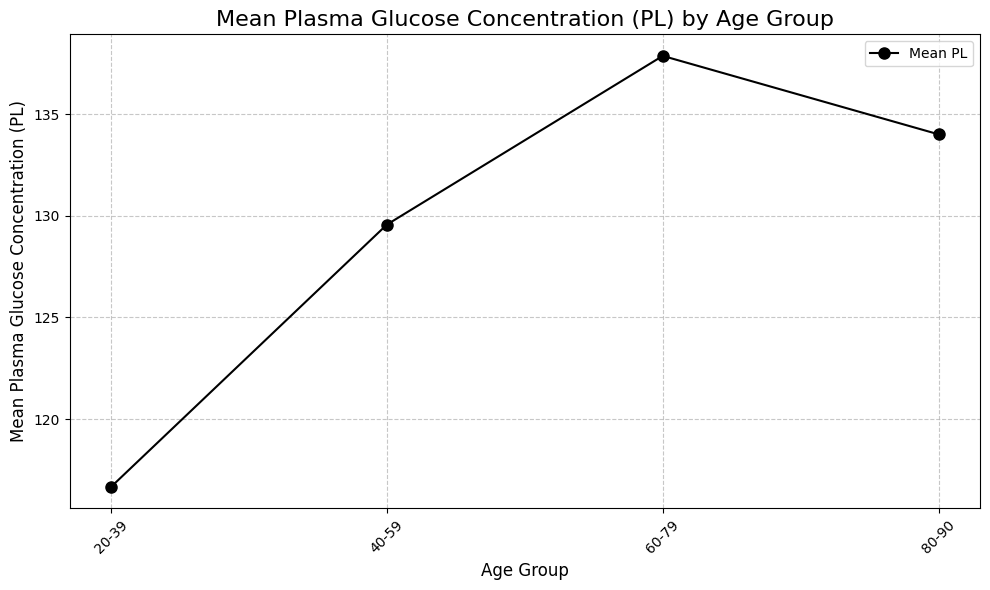

# Sepsis-Classification-ML-Project-with-FAST-API-Integration
This repository houses a machine learning project focused on the early detection and classification of sepsis, and integrating the model into a web application using FAST API.

<p align="center">
  
</p>

This project aims to provide a streamlined tool for healthcare professionals to predict sepsis cases quickly and effectively.

## Summary
|     Jupyter Notebook                       | Published Article|    Deployed App on Hugging Face
| -------------                  | -------------    |    -----------------
|[Notebook with code and full analysis](https://github.com/rasmodev/Sepsis-Classification-ML-Project-with-FastAPI-Deployment/blob/main/dev/Sepsis_ML_Prediction_Deployment_With_FastAPI.ipynb)|  [Published Article on Medium](https://medium.com/@rasmowanyama/fastapi-for-machine-learning-deployment-a-beginners-guide-ee74ee41316f) |[Link to working FastAPI](https://rasmodev-sepsis-prediction.hf.space/docs/)

## FastAPI Interface
After clicking on the link to the working FastAPI, click on "Try It Out", add the patient's medical details, and click on the **"EXECUTE"** button.



### Before Prediction



### After Prediction


# Repository Contents:
- [Project Overview](#project-overview)
- [Project Setup](#project-setup)
- [Data Fields](#data-fields)
- [Getting Started](#getting-started)
- [Business Understanding](#business-understanding)
- [Data Understanding](#data-understanding)
- [Data Preparation](#data-preparation)
- [Modeling](#modeling)
- [Evaluation](#evaluation)
- [Deployment](#deployment)
- [Author](#author)


# Project Overview:
**i. Data Collection and Preprocessing:** I loaded and preprocessed a comprehensive dataset containing clinical and physiological data from patients to train and evaluate the sepsis classification model.

**ii. Machine Learning Model:** I implemented a state-of-the-art machine learning model tailored for sepsis classification. This model has been fine-tuned to achieve high accuracy in detecting sepsis early, which is crucial for timely intervention.

**iii. FAST API Integration:** I've seamlessly integrated the trained machine learning model into a web application using FAST API. This web application allows healthcare professionals to input patient data and receive instant predictions regarding sepsis risk.

**iv. Usage and Deployment:** In this README file, you will find detailed instructions on how to use and deploy this web application, making it user-friendly for both developers and healthcare practitioners.

# Project Setup:
To set up the project environment, follow these steps:

i. Clone the repository:

git clone my_github 

```bash 
https://github.com/rasmodev/Sepsis-Classification-ML-Project-with-FastAPI-Deployment.git
```

ii. Create a virtual environment and install the required dependencies:

- **Windows:**
  ```bash
  python -m venv venv; venv\Scripts\activate; python -m pip install -q --upgrade pip; python -m pip install -qr requirements.txt
  ```

- **Linux & MacOS:**
  ```bash
  python3 -m venv venv; source venv/bin/activate; python -m pip install -q --upgrade pip; python -m pip install -qr requirements.txt  
  ```
You can copy each command above and run them in your terminal to easily set up the project environment.

## Data Fields
The data used in this project consists of a diverse collection of sepsis cases obtained from [Sepsis](https://www.kaggle.com/datasets/chaunguynnghunh/sepsis?select=README.md).

| Column Name | Data Features | Description                                      |
|-------------|-----------------|--------------------------------------------------|
| ID          | N/A             | Unique identifier for each patient               |
| PRG         | Attribute 1     | Number of pregnancies (applicable only to females) |
| PL          | Attribute 2     | Plasma glucose concentration (mg/dL)             |
| PR          | Attribute 3     | Diastolic blood pressure (mm Hg)                 |
| SK          | Attribute 4     | Triceps skinfold thickness (mm)                  |
| TS          | Attribute 5     | 2-hour serum insulin (mu U/ml)                   |
| M11         | Attribute 6     | Body mass index (BMI) (weight in kg / {(height in m)}^2) |
| BD2         | Attribute 7     | Diabetes pedigree function (mu U/ml)             |
| Age         | Attribute 8     | Age of the patient (years)                       |
| Insurance   | N/A             | Whether the patient has insurance coverage (1 for Yes, 0 for No) |
| Sepsis      | Target          | Target variable - Positive: if a patient in ICU will develop sepsis,<br> Negative: otherwise |

"ID" and "Insurance" are marked as "N/A" because they do not contribute to predicting whether a patient in the ICU will develop sepsis. These columns were excluded during feature selection because they did not provide relevant information for the sepsis prediction model.


# Machine Learning Lifecycle
I employed the CRISP-DM (Cross-Industry Standard Process for Data Mining) methodology in this project. 

<p align="center">
  
</p>

Here are the steps I undertook:

## Business Understanding:

I began by understanding the problem domain, which involved predicting sepsis in ICU patients.
I defined the project goals and objectives, such as early sepsis detection, which can save lives.

## Data Understanding:
I collected the test and train datasets from Kaggle, which included various patient attributes. The train dataset had, sepsis, the target variable, while the test dataset did not have the target variable since this dataset is what I later used to predict sepsis. 

After an overview of the first few columns, I formulated the hypothesis and key analytical questions that would guide the understanding of the datasets.

**Hypothesis:** 
Null Hypothesis (H0): There is no significant association between the patient's age and the likelihood of sepsis.

Alternative Hypothesis (H1): There is a significant association between the patient's age and the likelihood of sepsis.

**Key Analytical Questions:** 

- i. Are there any correlations or patterns between the numerical features (e.g., PRG, PL, PR, SK, TS, M11, BD2, Age) and the presence of sepsis (Positive/Negative)?

- ii. How does the distribution of key numerical variables (e.g., PR, SK, TS, M11) differ between patients with and without sepsis?

- iii. Is there a relationship between the number of pregnancies (PRG) and plasma glucose concentration (PL)? Does this relationship vary with the presence of sepsis?

- iv. Are there any significant differences in diastolic blood pressure (PR) between patients with different triceps skinfold thickness (SK) levels?

- v. Does the body mass index (M11) vary significantly with 2-hour serum insulin (TS) levels?

- vi. Is there a correlation between the diabetes pedigree function (BD2) and age? How does this correlation affect the likelihood of sepsis?

- vii. Are patients with insurance coverage more likely to have certain health characteristics (e.g., higher age, higher BMI) compared to those without insurance coverage?


### Understanding the datasets
I conducted an in-depth exploration of the datasets to gain insights into the available variables,their distributions and relationships, including:

- i. Column Information of The Datasets using the .info method.

- ii. Shape of The Datasets

- iii. Summary Statistics Datasets

- iv. Checking for Missing Values in The Datasets

- v. Checking for Duplicates in The Datasets

These steps provided an initial undertanding of the datasets to identify any data quality issues that informed the cleaning and pre-processing steps.

I then conducted an extensive Exploratory Data Analysis (EDA) to get insights into the structure and quality of the dataset.

### Exploratory Data Analysis (EDA)
During the EDA phase, a comprehensive investigation of the sepsis dataset was conducted to gain insights through various types of analyses.

i. **Univariate analysis:** I performed a thorough individual examination of each variable looking at aspects such as summary statistics (mean, median, standard deviation, and quartiles) using the .describe method to understand the central tendency and spread of the data.

<p align="center">
  
</p>

ii. **Bivariate analysis:** Relationships between pairs of variables were explored to identify patterns and potential predictor variables for sepsis classification.

<p align="center">
  
</p>

iii. **Multivariate analysis:** Relationships among multiple variables were examined simultaneously, allowing for a deeper understanding of their interactions and impact on sepsis.

<p align="center">
  
</p>

In addition to these exploratory analyses, I tested my hypothesis and answered key analytical questions.

## Data Preparation:
- I preprocessed the data by performing data cleaning by:

 i. imputing zero values that did not make sense in some of the columns with the mean value of each age group.
 ii. Dropping unnecessary columns 

- I encoded the target variable (Sepsis), the only categorical variable needed for modeling, using Label Encoding.
- I then conducted feature engineering to select relevant features and prepare them for modeling.


## Modeling:

- I split the train dataset into training (80%) and evaluation (20%) sets.
- To properly train and evaluate the models, I took into consideration the imbalanced nature of the traget variables/ class in the training set. 

<p align="center">
  
</p>

- I used random oversampling to balance the target class. Addressing this class imbalance is important to ensure that the machine learning model can make accurate predictions for both classes and is not biased towards the majority class.

<p align="center">
  
</p>

- I also scaled the training and evaluation sets to ensure they were within the same range.

- In this project, I compared 7 different classification algorithms:

i. Logistic Regression

ii. Random Forest Classifier

iii. K-Nearest Neighbors Classifier

iv. Decision Tree Classifier

v. Gradient Boosting Classifier

vi. Gaussian Naive Bayes

vii. Support Vector Machine

- I assessed model performance using evaluation metrics such as accuracy, precision, recall, and F1-score (the harmonic mean of precision and recall which provides a balanced measure of the model's performance).

The model performance was as follows:

<p align="center">
  
</p>

Based on the f1 score, the Gradient Boosting Classifier was the best performing model.

## Evaluation:

I evaluated the model's performance on the testing dataset to ensure its generalizability.
I used various evaluation metrics to assess how well the model predicted sepsis cases.


## Deployment:
**i. FastAPI**. 
The model is deployed as a FastAPI web service, which provides an API for sepsis prediction. This deployment offers an intuitive interface for users to input patient data and obtain predictions.

**ii. Docker Containerization**
The application is containerized using Docker, making it easy to package and run in various environments with consistent behavior.

**iii. Hugging Face Deployment**
The application is containerized using Docker, making it easy to package and run in various environments with consistent behavior.

# Conclusion
Following the CRISP-DM methodology, I systematically addressed the sepsis prediction problem, from understanding the business context to deploying a machine learning model as a practical tool for early sepsis detection in clinical settings.

# Author

`Rasmo Wanyama`

`Data Analyst/Data Scientist`

Let's connect on LinkedIn:

[](https://www.linkedin.com/in/rasmo-/) 


# Acknowledgments:
We would like to thank the open-source community and the healthcare professionals who contributed to the dataset used in this project. Their efforts have made advancements in sepsis detection possible.

Feel free to explore the code, use the web application, and contribute to the project's development. Early sepsis detection can save lives, and together, we can make a difference in healthcare.
