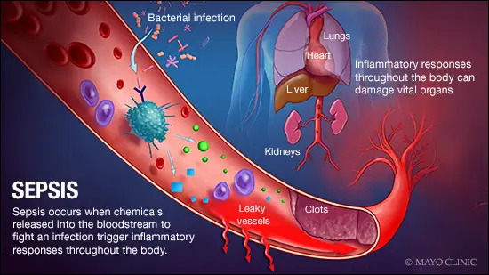

# Sepsis-Classification-ML-Project-with-FAST-API-Integration
This repository houses a machine learning project focused on the early detection and classification of sepsis, and integrating the model into a web application using FAST API.

<p align="center">
  
</p>

This project aims to provide a streamlined tool for healthcare professionals to predict sepsis cases quickly and effectively.

## Summary
|     Jupyter Notebook                       | Published Article|    Deployed App on Hugging Face
| -------------                  | -------------    |    -----------------
|[Notebook with code and full analysis](https://github.com/rasmodev/Sepsis-Classification-ML-Project-with-FastAPI-Deployment/blob/main/dev/Sepsis_ML_Prediction_Deployment_With_FastAPI.ipynb)|  [Published Article on Medium](https://medium.com/@rasmowanyama/fastapi-for-machine-learning-deployment-a-beginners-guide-ee74ee41316f) |[Link to working FastAPI](https://rasmodev-sepsis-prediction.hf.space/docs/)

# Repository Contents:
- [Project Overview](#project-overview)
- [Project Setup](#project-setup)
- [Data Fields](#data-fields)
- [Getting Started](#getting-started)
- [Modeling](#modeling)
- [Evaluation](#evaluation)
- [Deployment](#deployment)
- [Future Work](#future-work)
- [Contact](#contact)


# Project Overview:
**i. Data Collection and Preprocessing:** I loaded and preprocessed a comprehensive dataset containing clinical and physiological data from patients to train and evaluate the sepsis classification model.

**ii. Machine Learning Model:** I implemented a state-of-the-art machine learning model tailored for sepsis classification. This model has been fine-tuned to achieve high accuracy in detecting sepsis early, which is crucial for timely intervention.

**iii. FAST API Integration:** I've seamlessly integrated the trained machine learning model into a web application using FAST API. This web application allows healthcare professionals to input patient data and receive instant predictions regarding sepsis risk.

**iv. Usage and Deployment:** In this README file, you will find detailed instructions on how to use and deploy this web application, making it user-friendly for both developers and healthcare practitioners.

# Project Setup:
To set up the project environment, follow these steps:

i. Clone the repository:

git clone my_github 

```bash 
https://github.com/rasmodev/Sepsis-Classification-ML-Project-with-FastAPI-Deployment.git
```

ii. Create a virtual environment and install the required dependencies:

- **Windows:**
  ```bash
  python -m venv venv; venv\Scripts\activate; python -m pip install -q --upgrade pip; python -m pip install -qr requirements.txt
  ```

- **Linux & MacOS:**
  ```bash
  python3 -m venv venv; source venv/bin/activate; python -m pip install -q --upgrade pip; python -m pip install -qr requirements.txt  
  ```
You can copy each command above and run them in your terminal to easily set up the project environment.

## Data Fields
The data used in this project consists of a diverse collection of sepsis cases obtained from [Sepsis](https://www.kaggle.com/datasets/chaunguynnghunh/sepsis?select=README.md).

| Column Name | Data Features | Description                                      |
|-------------|-----------------|--------------------------------------------------|
| ID          | N/A             | Unique identifier for each patient               |
| PRG         | Attribute 1     | Number of pregnancies (applicable only to females) |
| PL          | Attribute 2     | Plasma glucose concentration (mg/dL)             |
| PR          | Attribute 3     | Diastolic blood pressure (mm Hg)                 |
| SK          | Attribute 4     | Triceps skinfold thickness (mm)                  |
| TS          | Attribute 5     | 2-hour serum insulin (mu U/ml)                   |
| M11         | Attribute 6     | Body mass index (BMI) (weight in kg / (height in m)^2) |
| BD2         | Attribute 7     | Diabetes pedigree function (mu U/ml)             |
| Age         | Attribute 8     | Age of the patient (years)                       |
| Insurance   | N/A             | Whether the patient has insurance coverage (1 for Yes, 0 for No) |
| Sepsis      | Target          | Positive: if a patient in ICU will develop sepsis,<br> Negative: otherwise |

"ID" and "Insurance" are marked as "N/A" because they do not contribute to predicting whether a patient in the ICU will develop sepsis. These columns were excluded during feature selection because they did not provide relevant information for the sepsis prediction model.


# Machine Learning Lifecycle
I employed the CRISP-DM (Cross-Industry Standard Process for Data Mining) methodology in this project. 
<p align="center">
  
</p>

Here are the steps I undertook:

Business Understanding:

I began by understanding the problem domain, which involved predicting sepsis in ICU patients.
I defined the project goals and objectives, such as early sepsis detection, which can save lives.
Data Understanding:

I collected the dataset from Kaggle, which included various patient attributes and sepsis labels.
I examined the dataset to get insights into its structure and quality.
Data Preparation:

I preprocessed the data by handling missing values and performing data cleaning.
I encoded categorical variables as needed for modeling.
I conducted feature engineering to select relevant features and prepare them for modeling.
Modeling:

I chose an appropriate machine learning algorithm for binary classification.
I split the data into training and testing sets.
I trained the model using the training data and tuned hyperparameters for optimal performance.
I assessed model performance using evaluation metrics such as accuracy, precision, recall, and F1-score.
Evaluation:

I evaluated the model's performance on the testing dataset to ensure its generalizability.
I used various evaluation metrics to assess how well the model predicted sepsis cases.
Deployment:

I deployed the model as a FastAPI web service, creating an API for sepsis prediction.
I provided an easy-to-use interface for users to input patient data and receive predictions.
Feedback (Optional):

In real-world applications, this step involves collecting feedback from users and monitoring the model's performance.
Documentation:

I documented the entire project, including data sources, preprocessing steps, modeling techniques, and API usage, to facilitate future reference and collaboration.
By following the CRISP-DM methodology, I systematically addressed the sepsis prediction problem, from understanding the business context to deploying a machine learning model as a practical tool for early sepsis detection in clinical settings.


# Contributing:
Your contributions are welcome to improve the model's performance, add new features, or enhance the web application's usability. Please refer to our contribution guidelines in the repository to get started.

# License:
This project is licensed under the MIT License.

# Acknowledgments:
We would like to thank the open-source community and the healthcare professionals who contributed to the dataset used in this project. Their efforts have made advancements in sepsis detection possible.

Feel free to explore the code, use the web application, and contribute to the project's development. Early sepsis detection can save lives, and together, we can make a difference in healthcare.
